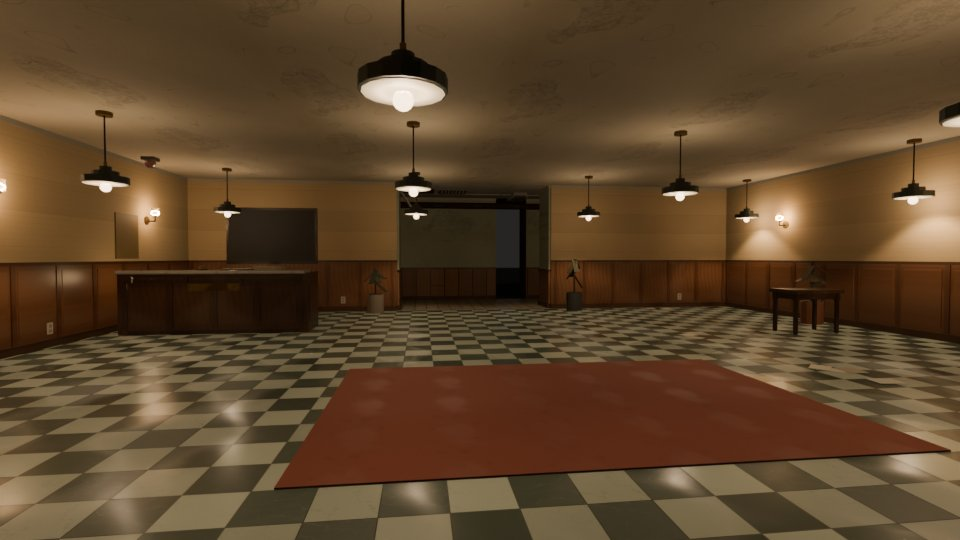
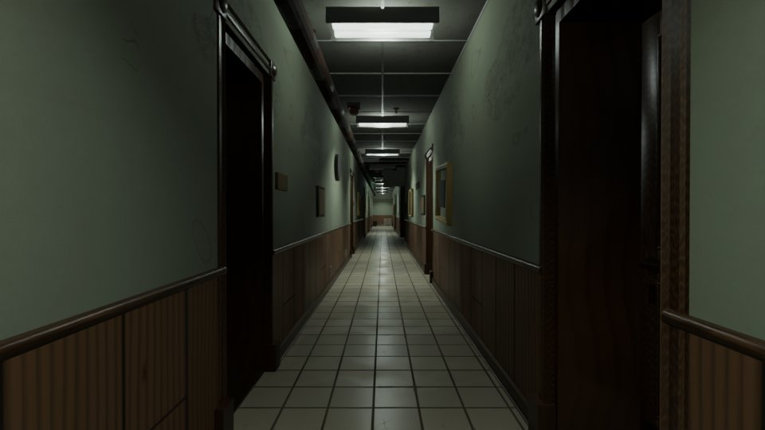
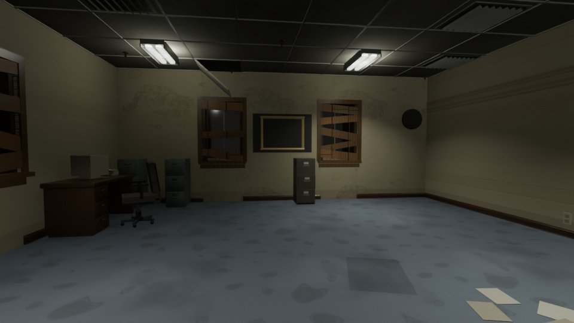
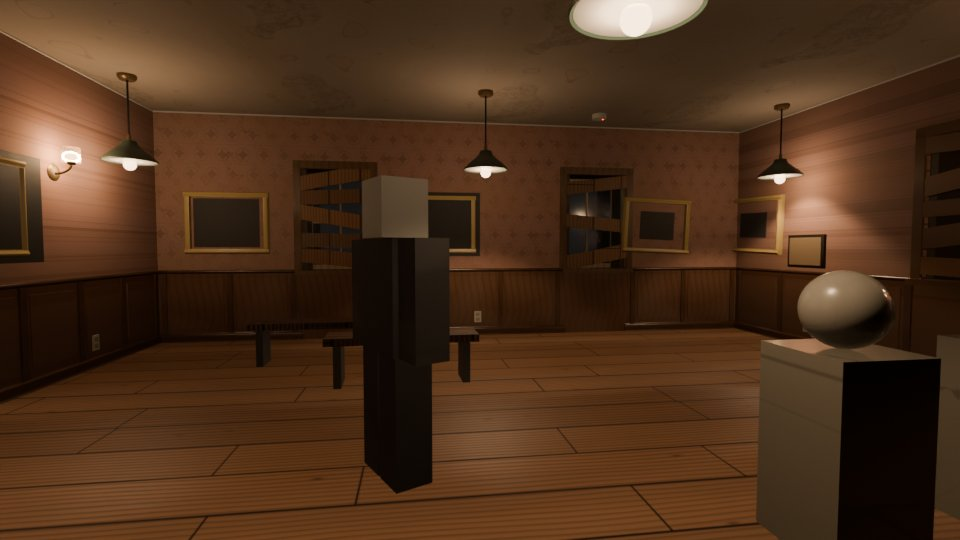
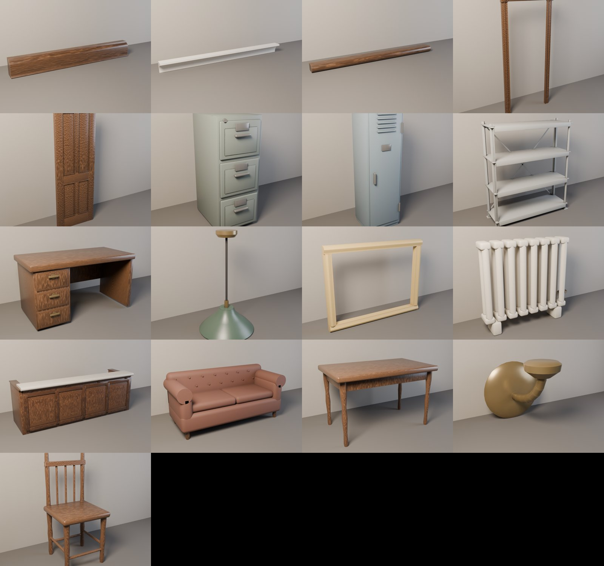

# Pipeline de assets propio (Blender → Roblox)

## 1. Herramientas comprobadas en este entorno

| Herramienta | Estado | Uso |
|---|---|---|
| Blender 5.2.2 (módulo `bpy`, desde PyPI) | **disponible**: instalado en `~/.venv-blender` | modelado, materiales, UV, horneado PBR, exportación OBJ, renders Cycles |
| numpy + Pillow | disponibles | texturas en mosaico (`tools/gen_textures.py`), calcomanías (`tools/gen_decals.py`) |
| Generador de imágenes (difusión, IA) | **no disponible**: sin modelos y sin acceso a Hugging Face | — |
| Bibliotecas de texturas escaneadas (Poly Haven, ambientCG) | **bloqueadas** por la red del entorno | — |
| Roblox Studio | **no disponible** | importar mallas, subir imágenes y verlo en el motor real: lo haces tú |

Consecuencia honesta: **todas las texturas y materiales son procedurales**
(creados por código), no fotografías. En las mallas, Blender hornea sobre la
geometría de cada objeto:

- la suciedad de las cavidades (oclusión ambiental);
- el desgaste de las aristas;
- la veta;
- el relieve.

## 2. Activos creados (17 mallas reales, cada una con sus mapas PBR horneados)

Todo en `assets/props/`. Lo genera `tools/blender/build_assets.py`.

| Activo | Triángulos | Sustituye en el juego |
|---|---|---|
| ReceptionDesk | 2.716 | mostrador de recepción |
| DoorLeaf | 7.796 | hoja de todas las puertas de madera (se mueve con la puerta) |
| DoorCasing | 708 | marco de cada cara de cada puerta |
| PendantLamp | 1.408 | lámpara colgante (la bombilla sigue siendo la pieza luminosa) |
| WallSconce | 800 | aplique de pared |
| Radiator | 4.344 | radiadores |
| WoodChair | 1.548 | silla de madera |
| Table | 1.644 | mesa 5 × 3 |
| Sofa | 3.184 | sofá |
| FilingCabinet | 2.036 | archivador (con los cajones cerrados) |
| OfficeDesk | 1.436 | escritorio de oficina |
| Locker | 1.232 | taquilla |
| MetalShelf | 2.616 | estantería metálica de 6 de ancho |
| PictureFrame | 112 | marco de todos los cuadros (escalado a cada cuadro) |
| Baseboard | 44 | rodapiés de todo el mapa (estirado a cada tramo) |
| DadoRail | 48 | molduras de zócalo |
| Cornice | 52 | cornisas |

Por cada activo hay:

- `<Asset>.obj`, en studs y con los ejes de Roblox;
- `<Asset>/<Asset>_color|normal|roughness|metalness.png` a 1024 px, con la
  normal en convención OpenGL, la que usa SurfaceAppearance;
- `previews/<Asset>.png`, el render de revisión.

Todos están por debajo del límite de 20.000 triángulos por malla de Roblox, y
el test lo comprueba.

## 3. Integración en el juego

- **`src/shared/PropMeshes.luau`.**
  - Carga los Model importados con `InsertService`, igual que el Observer.
  - Les pone la SurfaceAppearance de `src/shared/PropSkins/<Asset>.model.json`,
    que escribe `tools/sync_assets.py`.
  - Viste el mapa (`dress`).
- **Los constructores no dependen de las mallas.** Marcan:
  - `MeshAsset`, `MeshOrigin` y `MeshFollow` en el modelo;
  - `MeshHide` en las piezas que sustituye la malla;
  - `MeshStretchX` en los tramos y `MeshSize` en los marcos.
- **`MapService`.** Viste cada mapa al construirlo, y el mapa actual cuando
  terminan de cargar las mallas.
- **Las piezas sustituidas siguen ahí, invisibles.** Por eso la colisión, la
  interacción, las anomalías, el validador de geometría y la navegación no
  cambian.
- **Las puertas.** La malla de la hoja lleva su `Offset` y se mueve con la
  animación de `DoorController` y `DoorService`.
- **Marketing Studio.** Los decorados de puerta y habitación usan la misma
  malla `DoorLeaf` cuando está cargada.

## 4. Lo que tienes que hacer en Studio (una vez)

1. **Importar los OBJ.** Asset Manager → Import 3D → cada
   `assets/props/<Asset>.obj`. Copia el ID del Model.
2. **Subir los mapas.** Asset Manager → Bulk Import de las PNG de
   `assets/props/<Asset>/`.
   - Los `_metalness` solo hacen falta en PendantLamp, WallSconce, Radiator,
     FilingCabinet, Locker y OfficeDesk.
3. **Pasarme los IDs** (una captura vale). Yo relleno `AssetIds.PropMeshes` y
   ejecuto `sync_assets.py`.

Hasta entonces el juego se ve como ahora: modelos de piezas y texturas en mosaico.

## 5. Pruebas ejecutadas de verdad

**`tools/runtime_test.luau`: 119.151 comprobaciones, 0 fallos.** En la sección
de mallas:

- existen las 17 mallas con sus mapas, y todas tienen menos de 20.000
  triángulos;
- con plantillas del tamaño exacto de cada malla se viste un mapa real: 1.001
  objetos;
- cada malla cae dentro de la caja de las piezas que sustituye (0 mal
  colocadas), lo que detecta errores de orientación y desplazamiento;
- las piezas sustituidas quedan ocultas;
- las mallas que siguen a una pieza llevan `Offset`;
- el validador de geometría da 0 incidencias con las mallas puestas.

**`tools/client_test.luau`: 71.379 comprobaciones, 0 fallos.** El analizador no
añade líneas nuevas.

**Renders Cycles de cada activo:** `assets/props/previews/`, revisados uno a uno.
Encontré y corregí estos defectos:

- cuadrados negros por caras coplanarias en el mostrador;
- veta cruzada y patrón en cebra en las maderas (comprobado con un render de
  prueba);
- latón negro por metalicidad completa;
- botones del sofá desplazados por un giro aplicado alrededor del origen del
  mundo;
- piezas torneadas facetadas;
- un radiador que se metía en el rodapié de la pared contigua (lo detectó el
  validador).

**Validez de los archivos:** los 17 OBJ tienen caras (44 a 7.796 triángulos)
y las 104 PNG pasan `PIL.Image.verify()`.

**Renders de salas reales en contexto** (`tools/blender/render_room.py`):

- reconstruye una sala del mapa que genera el juego (semilla 8919), con sus
  texturas y, en modo `meshes`, las mallas en su `MeshOrigin`;
- solo luz directa más el Ambient del perfil, como Roblox;
- **no es el render de Roblox.**

| Render | Archivo |
|---|---|
| Recepción solo con piezas (antes) |  |
| Recepción con las mallas (después): mostrador, lámparas, apliques, marcos, molduras |  |
| Pasillo G_c: marcos y hojas de puerta, zócalo, rodapié |  |
| Oficina G_a: escritorio, archivadores, rodapiés |  |
| Galería U_v: marcos, lámparas, apliques |  |
| Las 17 mallas |  |

En BLACKOUT la recepción queda negra en el render. Es correcto: no tiene
lámparas del circuito de emergencia, y el render apaga las bombillas igual que
`LightController`, que las pasa a cristal oscuro. Ahí solo ilumina la linterna,
que el render no simula. Antes del arreglo el render dejaba las bombillas
brillando y daba una imagen engañosa.

## 6. Límites

- **Nada de esto se ha visto en Roblox Studio.** Los renders son de Blender.
- **Las texturas son procedurales**, no fotografías: no hay generador de
  imágenes ni acceso a bibliotecas escaneadas.
- **Las mallas no se ven en el juego hasta que importes los 17 OBJ y subas sus
  mapas.**
- **Los tramos (rodapié, zócalo, cornisa) se estiran:** la veta del rodapié se
  alarga en los tramos largos.
- **Siguen hechos de piezas:**
  - el maniquí y las estatuas de la galería;
  - los archivadores con un cajón abierto;
  - camas, estanterías de archivo, maquinaria del sótano y cocina.
- **Los cuadros salen negros en los renders** porque el render no dibuja
  calcomanías ni SurfaceGui. En el juego sí se ven.
- **Rendimiento:** unas 1.000 MeshParts por mapa. Son instancias de 17 mallas
  y Roblox las agrupa, pero hay que medir los FPS en móvil. La puerta, con 7.800
  triángulos, es lo más caro (25 puertas).
